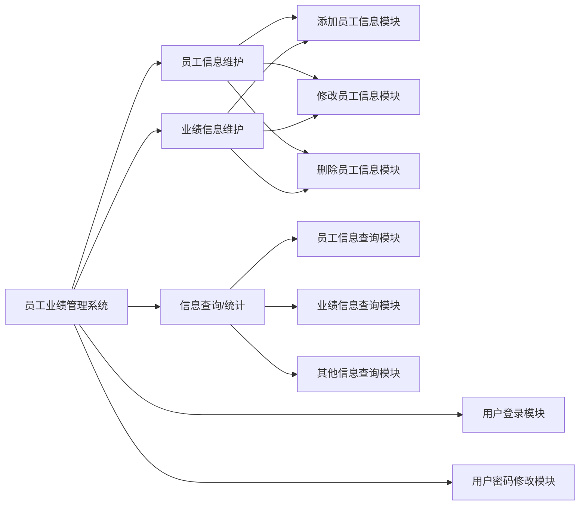

# 程序设计题：企业员工业绩管理系统

## 1 系统的基本功能

本课题要求编写Python程序实现对员工信息和业绩信息的管理。一个综合的员工业绩管理系统，要求能够管理若干个员工各季度工作业绩，需要实现以下功能：读取以数据文件形式存储的员工信息；可以按工号增加、修改、删除员工的信息；按照工号、姓名、名次等方式查询员工信息；可以按照工号顺序浏览员工信息；可以统计各季度工作的最高业绩、最低业绩和平均业绩；计算每个员工的总业绩并进行排名。

系统内的所有信息必须以文件的方式存储在硬盘中，员工信息文件，存放了员工的工号，姓名，性别，各个季度的业绩，四个季度的总业绩，依据总业绩的排名。格式如下：

```csv
B01,Tom,Male,70,80,90,85

B02,Rose,Female,70,80,90,75

B03,Jack,Male,80,90, 95,70

……
```

## 2 要求及提示

### 2.1 基本要求

系统提供的基本功能包括：

1. 系统内的相关信息文件由程序设计人员预先从键盘上录入，文件中的数据记录不得少于20条；
2. 设计并实现系统的相关界面，提供良好的交互界面；
3. 排序功能：能实现由用户选择按各项数据升序或降序排序对查询出的信息进行显示；
4. 可以添加/删除/修改员工信息；
5. 可以添加/删除/修改业绩信息；
6. 查询员工信息：

   - 输入一个工号，查出此人的基本信息并显示输出。
   - 输入一个工号，查询出此员工的所有业绩情况。
7. 查询业绩信息：

   - 输入一个部门编号，可查询出本部门所有的员工的基本信息并显示输出。

### 2.2 选做要求

1. 使用Tkinter或其他GUI函数库，为本课题设计一个可视化的界面，要求界面美观、布局合理、功能正确以及对用户的错误操作能够进行友好提示。

### 2.3 提示

程序的总体框图如下：



图1 员工业绩管理系统总体框图

数据结构：

依据给定的员工信息、季度信息和业绩信息，定义员工类，设计内容如下：

```python
class Staff(object):
    #员工信息类
    def __init__(self, num ,name, gender, score):
        self.num = num                   	#工号
        self.name = name                 	#姓名
        self.gender = gender             	#性别
        self.score = score               	#各季度业绩
        self.total = None               	#总业绩
        self.rank = None                 	#名次

```

### 2.4 其他要求

1. 在上述功能要求的基础上，为了提高本课程的成绩，可以和任课教师沟通，为程序设计题添加一些额外的功能。
2. 变量、方法命名符合规范。
3. 注释详细：每个变量都要求有注释说明用途；方法有注释说明功能，对参数、返回值也要以注释的形式说明用途；关键的语句段要求有注释解释。
4. 程序的层次清晰，可读性强。

## 3 开发环境

开发环境使用Python3以上版本，开发工具可以选择IDLE或者PyCharm等集成开发工具。
